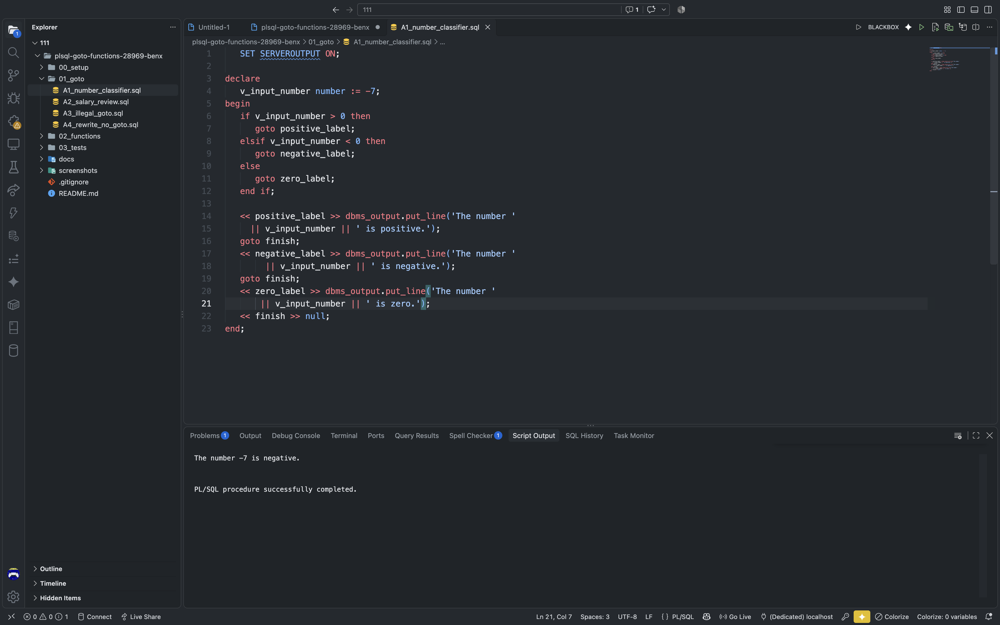
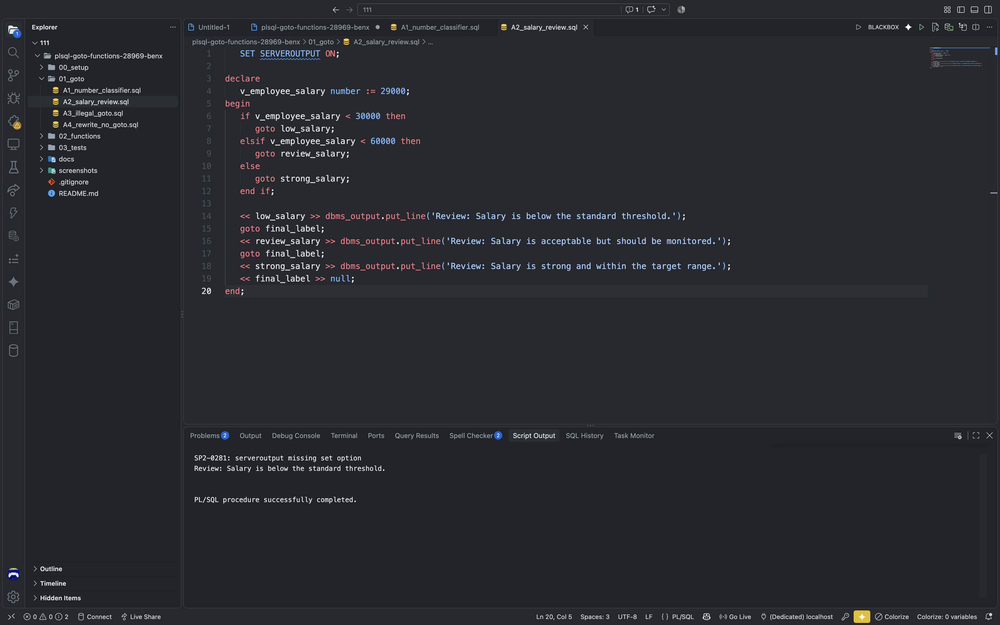
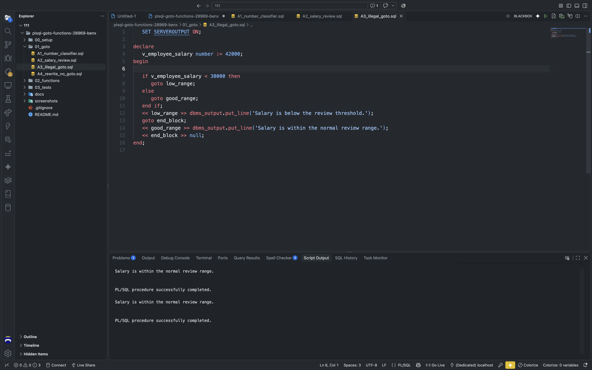
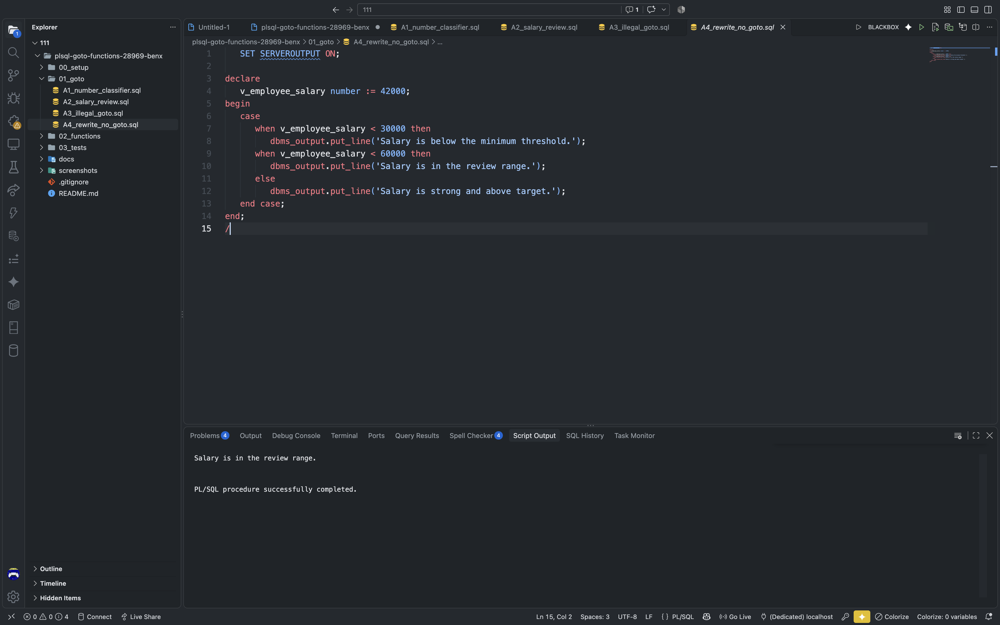
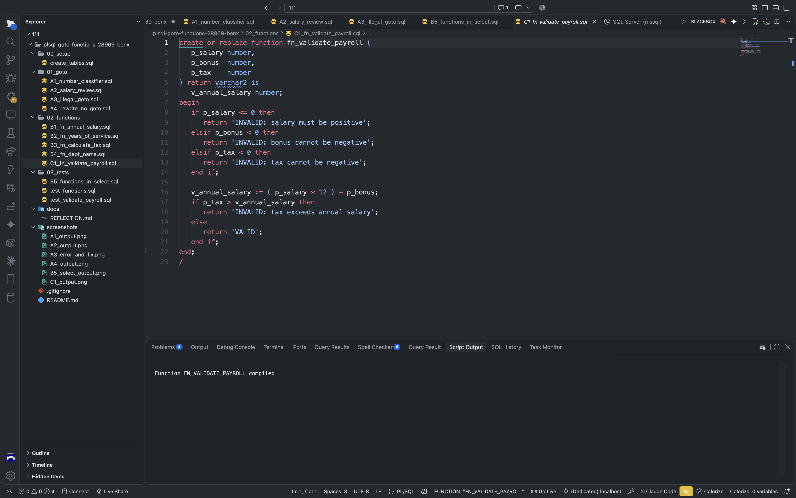

# plsql-goto-functions-28969-benx

## Student Information

- Name: **Benx**
- Student ID: **28969**
- DBMS used: **Oracle Database Free in Docker (PDB FREEPDB1)**
- Repository name: `plsql-goto-functions-28969-benx`

## Summary

This repository contains my PL/SQL assignment work on GOTO statements, stored functions, payroll validation, and SQL-based function testing. The project is organized into setup scripts, task files, and final verification outputs, all designed to run in an Oracle Database environment.

The assignment focuses on the core idea of using PL/SQL logic to solve practical database problems, including value classification, salary review checks, tax calculation, department lookup, and validation of payroll inputs.

## Assignment Overview

The work in this project includes:

- GOTO labels and decision-based control flow
- Stored functions in PL/SQL
- SQL usage of functions in SELECT statements
- Exception handling and department lookup logic
- Payroll validation rules for salary, bonus, and tax

## Repository Structure

```text
plsql-goto-functions-28969-benx/
├── README.md
├── .gitignore
├── 00_setup/
│   └── create_tables.sql
├── 01_goto/
│   ├── A1_number_classifier.sql
│   ├── A2_salary_review.sql
│   ├── A3_illegal_goto.sql
│   └── A4_rewrite_no_goto.sql
├── 02_functions/
│   ├── B1_fn_annual_salary.sql
│   ├── B2_fn_years_of_service.sql
│   ├── B3_fn_calculate_tax.sql
│   ├── B4_fn_dept_name.sql
│   └── C1_fn_validate_payroll.sql
├── 03_tests/
│   ├── B5_functions_in_select.sql
│   ├── test_functions.sql
│   └── test_validate_payroll.sql
├── screenshots/
│   └── assignment output screenshots
├── docs/
│   └── REFLECTION.md
└── .git/
```

## How To Run It

1. Start the Oracle Database container.
2. Connect to the Oracle database using SQL*Plus or SQL Developer.
3. Run the setup script:

```sql
@00_setup/create_tables.sql
```

4. Compile the functions in the `02_functions` folder.
5. Run the GOTO examples from `01_goto`.
6. Execute the test scripts in `03_tests`.
7. Review the outputs and compare with the screenshots in the `screenshots` folder.

Example connection:

```bash
sqlplus benx_plsqlauca_28969/Pass123@//localhost:1521/FREEPDB1
```

## GOTO Programs

### A1: Number Classifier

This program classifies numbers into positive, negative, zero, and invalid values using GOTO-based labels and branch flow.

### A2: Salary Review

This program evaluates employee salary ranges, identifies whether a person is underpaid, fairly paid, or highly paid, and uses labels to structure the decision logic.

### A3: Illegal GOTO Example

This task demonstrates what an illegal GOTO statement looks like and presents the corrected version using safe, structured flow.

### A4: Rewrite Without GOTO

This script reimplements the same logic as A1 and A2 without using GOTO, showing how the same result can be achieved with cleaner conditional control flow.

## Functions Created

### B1: Annual Salary

Calculates yearly salary from monthly salary and bonus.

### B2: Years of Service

Computes the number of years an employee has worked based on appointment date and current date.

### B3: Tax Calculation

Returns the tax amount based on salary band or amount thresholds.

### B4: Department Name

Returns the department name for a given department ID and handles missing or invalid values with exception logic.

### C1: Payroll Validation

Validates whether salary, bonus, and tax values are logically consistent before accepting the payroll record as valid.

## SQL Function Testing

The `B5_functions_in_select.sql` script demonstrates how stored functions can be called directly from SQL queries to return useful employee-level values such as annual salary, years of service, tax, and department name.

Example query:

```sql
SELECT
    e.employee_id,
    e.first_name || ' ' || e.last_name AS employee_name,
    fn_annual_salary(e.salary, e.annual_bonus) AS annual_salary,
    fn_years_of_service(e.hire_date) AS years_of_service,
    fn_calculate_tax(fn_annual_salary(e.salary, e.annual_bonus)) AS annual_tax,
    fn_dept_name(e.department_id) AS department_name
FROM employees e
ORDER BY e.employee_id;
```

## Screenshots

The screenshots below show the key outputs from the assignment and confirm that the scripts ran successfully in the Oracle environment.

### A1: Number Classifier

This output shows the program classifying values as positive, negative, zero, or invalid.



### A2: Salary Review

This output shows the salary review categories assigned by the GOTO-based decision logic.



### A3: Illegal GOTO and Correction

This screenshot shows the illegal GOTO example and the corrected version.



### A4: Rewrite Without GOTO

This output demonstrates the equivalent decision flow rewritten without GOTO statements.



### B5: Functions in a SELECT Query

This query result shows stored functions calculating employee salary, service years, tax, and department name.



### C1: Payroll Validation

This output shows payroll validation results for valid and invalid salary, bonus, and tax inputs.


## Results and Interpretation

The project successfully demonstrates the use of PL/SQL control structures and stored functions to solve real business logic tasks. The database setup was completed, the functions were created and tested, and the SQL-based function queries returned consistent results for employee payroll data.

This assignment also shows how to validate logic before accepting data, which is highly important in payroll and financial calculations.

## Challenges and Resolutions

- **Database context issues:** Verified the correct Oracle schema before running object-dependent queries.
- **GOTO control-flow understanding:** Used clear labels and structured branching to explain decision flow.
- **Function validation:** Checked both valid and invalid payroll combinations to confirm result correctness.
- **Output verification:** Compared the script results with expected outputs to confirm the implementation was working.

## Submission Checklist

- Oracle setup script executed successfully
- All GOTO tasks compiled and tested
- All PL/SQL functions created correctly
- SQL function calls verified in SELECT statements
- Screenshots captured and saved in the repository
- README completed and uploaded to GitHub

## Final Note

This project is completed and stored in the repository for submission as the PL/SQL assignment solution. It follows the required structure, contains the working scripts, and includes the evidence outputs needed to demonstrate correct execution.
